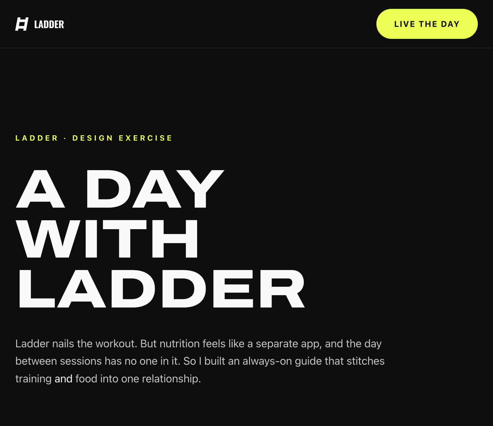
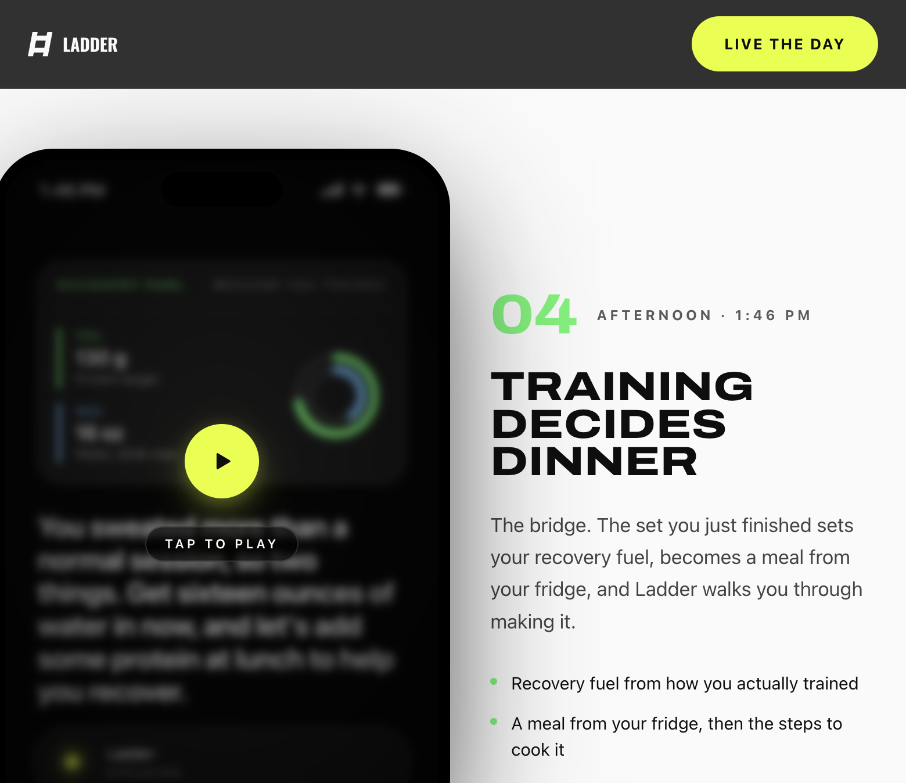

<div align="center">



# A Day with Ladder

### Less app. More relationship. All day.

A design exercise reimagining [Ladder](https://joinladder.com) as an always-on guide that
carries your training **and** nutrition through the whole day, so the relationship,
not the software, becomes the interface.

**[▶ Live the full day](https://ladder-production-2032.up.railway.app/play)** ·
**[Read the case study](https://ladder-production-2032.up.railway.app)** ·
**[Concept](CONCEPT.md)** ·
**[Process](docs/process/PROCESS.md)**

</div>

---

## What this is

A working, coded prototype, not a slide deck. It ships as two surfaces:

- **The case study** ([`/`](https://ladder-production-2032.up.railway.app)) — a scrollable
  story where every beat is a real, playable phone with generated voice.
- **The full day** ([`/play`](https://ladder-production-2032.up.railway.app/play)) — the
  five beats stitched into one continuous, end-to-end experience.

Each phone is the real prototype running in an iPhone frame: real audio, real video, paced
so an assistant's presence actually reads as presence.

## The idea in 30 seconds

Ladder is genuinely great at the workout, and the coach and team make it feel like yours.
Two gaps remain:

- **Nutrition feels separate.** Training and food live in different tabs, and different headspaces.
- **The day is unattended.** Workouts are scheduled; the choices between them are on you, alone.

So this prototype introduces **Ladder the assistant**: voice-first, ambient, and personalized
by your plan and history. It's the bridge that finally connects strength training and nutrition
inside a single relationship, and it knows when to step back. Ladder is the **sherpa, not the
coach**: it gets you into the work, goes quiet during the set, and picks you back up after.

## The day, beat by beat



| # | Time | Beat | What happens |
|---|------|------|--------------|
| 01 | 7:02 AM | **Mornings open on your day** | A streak worth keeping, today's workout placed on your home screen. |
| 02 | 1:00 PM | **The workout finds you** | Ladder lives outside the app, too. A home-screen widget, one tap into the work. |
| 03 | 1:02 PM | **Ladder goes quiet** | The real workout screen leads; Ladder steps back during the set, returns when you finish. |
| 04 | 1:46 PM | **Training decides dinner** | The bridge. Your set sets your recovery fuel, becomes a meal from your fridge. |
| 05 | 9:30 PM | **The relationship remembers** | A quiet recap, and tomorrow already adjusted. Ladder never resets to zero. |

## How it was built

The whole thing was built **agentically in [Cursor](https://cursor.com), driving Claude
Opus 4.8 High**, from pulling designs to wiring scenes to shipping.

| Layer | Tool | Role |
|-------|------|------|
| Coding agent | Cursor · Opus 4.8 | Built and iterated the app end to end |
| Design | Figma MCP | Pulled Ladder's real tokens, workout screen, and nutrition kit |
| Voice | fal · ElevenLabs | Every Ladder line ("Jessica") and member reply ("Matilda") |
| Video | fal · Grok Imagine | The workout clip behind the widget and in-class screen |
| App | Next.js · Tailwind · Framer Motion | iPhone-framed, scene-based playback |
| Pacing | Custom line sequencer | Dialogue synced to the exact audio duration |
| Deploy | Railway | Continuous deploy from `main` |

## Run it locally

```bash
npm install
npm run dev
```

Open [http://localhost:3000](http://localhost:3000) for the case study, or
[/play](http://localhost:3000/play) for the full day. Requires Node `>=22`.

```bash
npm run build   # production build
npm run lint    # eslint
```

## Project structure

```
src/
  app/
    page.tsx            # the case study (scrollable story)
    play/page.tsx       # the full interactive day
    layout.tsx          # fonts + metadata
  components/
    CaseStudy.tsx       # the marketing/case-study page
    Experience.tsx      # controller for the full day at /play
    ScenePlayer.tsx     # playable phone wrapper (preview, controls, auto-advance)
    PhoneFrame.tsx      # iPhone frame + status bar
    scenes/             # the five beats, one file each
      Morning · HomeScreen · InClass · Afternoon · Evening
    CoachDock · DayAhead · WorkoutWidget · StreakCal · Presence · ...
  lib/
    script.ts           # every line of dialogue + audio mapping
    useLineSequence.ts  # syncs captions/audio to real durations
public/
  audio/  videos/  food/  photos/   # generated voice, video, and imagery
```

## Documentation

- **[CONCEPT.md](CONCEPT.md)** — the full concept: the opportunity, the bet, the presence system, brand tokens.
- **[docs/process/PROCESS.md](docs/process/PROCESS.md)** — the process and the pivots, including what got cut and why.

---

<div align="center">

Design exercise for Ladder · Rocky Medure · 2026

</div>
