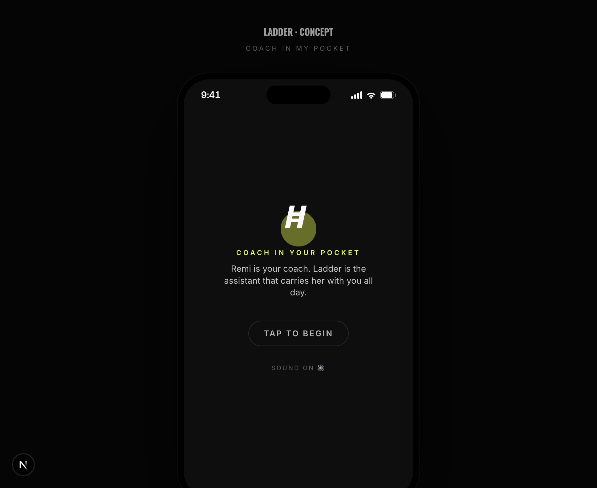
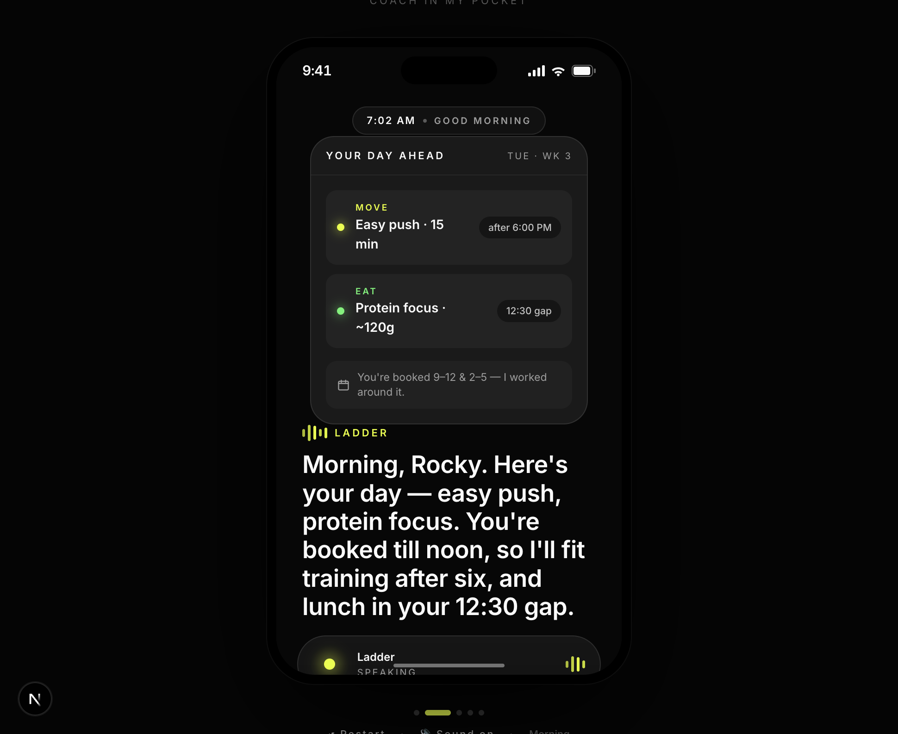
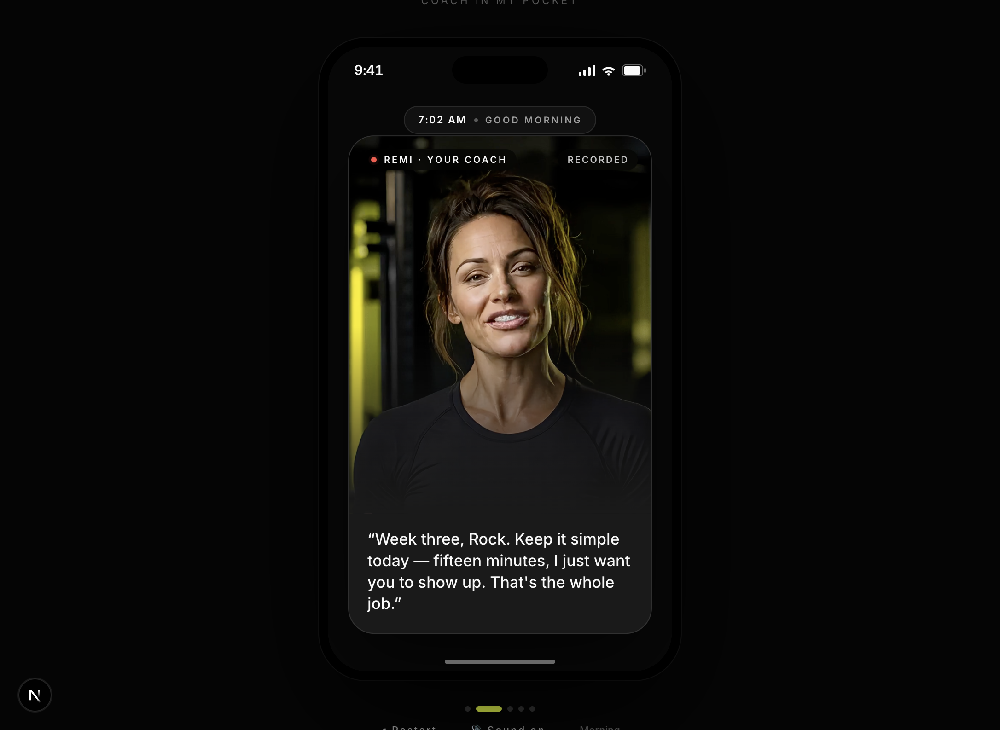
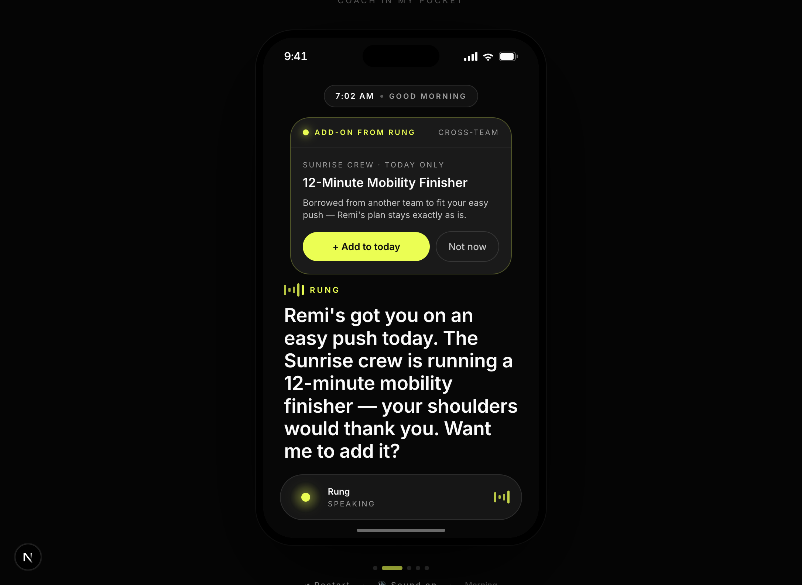
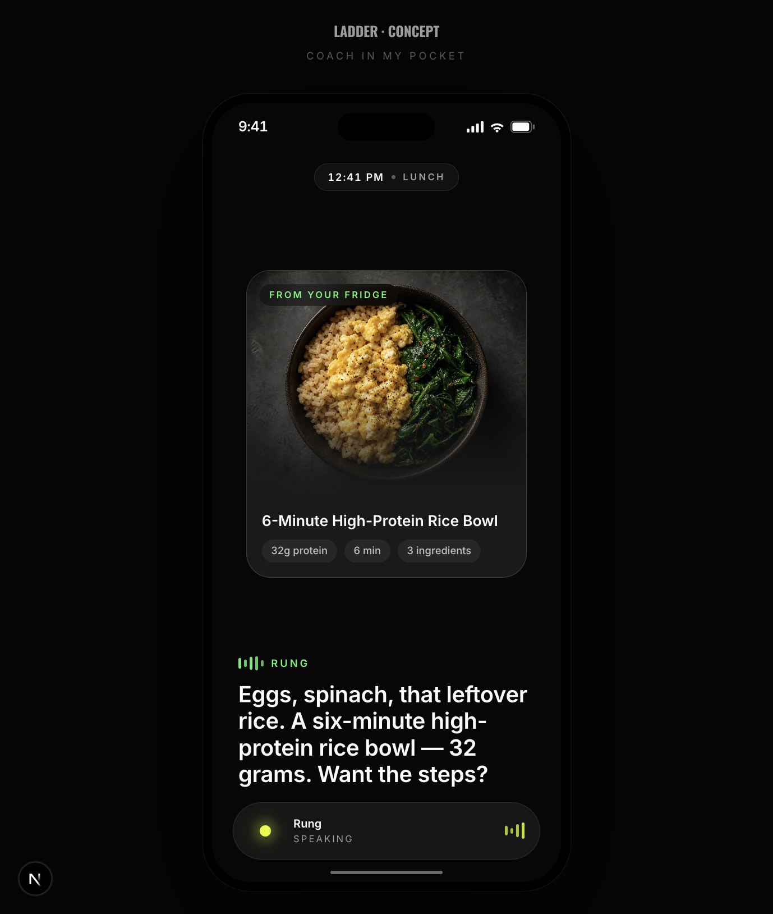
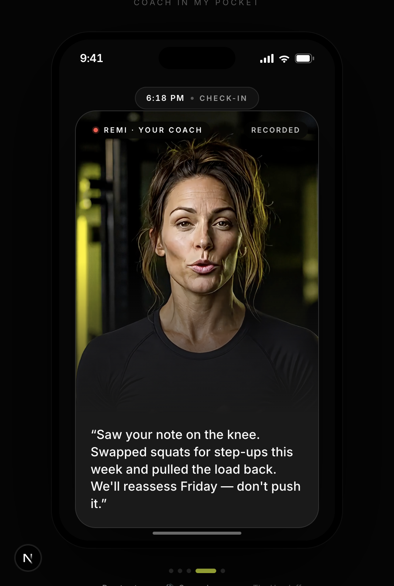
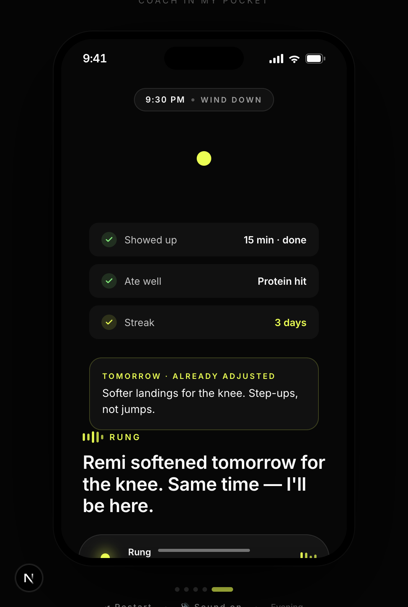
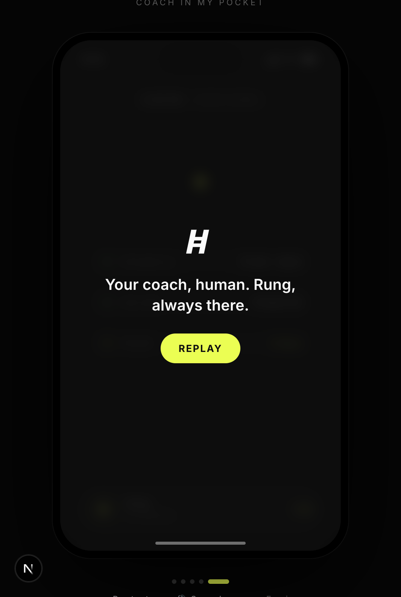

# Coach in My Pocket — Process & Reference

*How this concept was built, the decisions behind it, and where each screen landed.*
*A companion to [`CONCEPT.md`](../../CONCEPT.md) and the live prototype.*

---

## The brief, and how I read it

The exercise asked to **improve or re-imagine 1–2 screens/flows** of the Ladder app and
demonstrate "visual craft" and being a "true builder." Rather than reskin existing screens, I
treated the brief as a question: *what is Ladder's most valuable, least-scaled asset, and how do
we put it everywhere?*

The answer was **the human coach**. Today coaches live inside recorded videos and a UI-heavy
app (feeds, logging tables, dashboards) built for people "already motivated." The habit-making
moments happen when the coach *isn't* there. So instead of polishing a dashboard, I built the
thing the dashboard can't be: **a coach that's with you all day.**

This is a coded, interactive prototype (Next.js) with **real generated voice and video**, not
static mockups — because the whole idea is about presence and motion, which a flat comp can't show.

---

## The thinking, and the pivots

The strongest part of this exercise was the willingness to throw away good work when a better
idea showed up. The path:

1. **UI polish → relationship.** First instinct was to improve the live-workout and nutrition
   screens. We pushed past it: the app is *already* UI-heavy. The opportunity was **less UI, more
   relationship** — an agent that brings the coach into the moments between screens.

2. **"Coach in my pocket."** We committed to an ambient, voice-first coach for **training *and*
   nutrition** — present at the 12:40pm "what do I eat," the bad-knee Tuesday, the "I don't feel
   like it" mornings.

3. **AI twin → assistant.** I first built it as an **AI twin of the coach** (a clone of "Remi,"
   with her generated voice and talking-head video). Then we challenged it honestly: cloning a
   human is uncanny, erodes trust, and cannibalizes Ladder's moat. **We pivoted to an assistant.**

4. **Meet Rung.** The coach stays **human**. **Rung** is one Ladder-wide assistant that *scales*
   every coach — personalized by your coach's plan and your history. Coaches do what only they
   can; Rung covers the in-between for everyone. Faces are reserved for real humans; Rung is voice
   + ambient presence (never a fake face).

5. **Rung's superpower: do what the UI can't.** The clearest articulation of Rung's value — it can
   reach past the rigid app: *borrow another team's finisher for a day, swap a movement on the fly,
   slot training into a calendar gap.* Things the structured UI would never surface.

6. **Morning opens on the day ahead.** Latest iteration: the morning shouldn't drop you into a
   coach message — it should **brief you on your day** (how you'll move and eat) and **fit it to
   your real calendar**, then bring in the human note. Plan → human → add-on → go.

> Design law that fell out of this: **Face for emotion · Voice for action · Text for proof.**

---

## The product, in one line

**Your coach is human (Remi). Rung is the assistant that carries her with you all day — and does
the generous things the app's UI can't afford.**

---

## How it's built (the generative pipeline)

Everything in the demo is real playback, not faked:

| Layer | Tool | What it does |
|---|---|---|
| **App** | Next.js + Tailwind + Framer Motion | iPhone-framed, scene-based interactive prototype |
| **Rung's voice** | fal · xAI TTS (voice `sal`) | Every Rung line, in a voice deliberately distinct from any coach |
| **Coach's voice** | fal · xAI TTS (voice `ara`) | Remi's lines, used to drive her video |
| **Coach on video** | fal · ByteDance OmniHuman | Talking-head, lip-synced video from Remi's portrait + audio |
| **Coach's look** | image gen | Photoreal portrait identity for Remi |
| **Food** | image gen | The crave-able dish for the nutrition beat |

A small sequencer (`useLineSequence`) paces each beat to the **exact measured audio duration**, so
voice, captions, and visuals stay in sync. Human-coach moments play the **video with its native
audio**; Rung moments are voice + ambient aura.

---

## The demo, screen by screen

A single day — "A day in your pocket." Each frame is a beat in the live prototype.

### 1 · Open — coach in your pocket
The premise up front: Remi is your coach; Rung carries her with you all day.

### 2 · Morning — your day ahead *(the latest iteration)*
Rung leads with **how you'll move and eat**, fit to your **real calendar** — easy push *after 6pm*,
protein focus in your *12:30 gap*, working around a booked 9–12 and 2–5. Practical first, before any
message.

### 3 · Morning — the human note
Then the soul: a **real recorded message from Remi** (generated talking-head). Faces are for humans.

### 4 · Morning — Rung does what the UI can't
The signature move: Rung offers a **cross-team add-on** — the Sunrise Crew's 12-minute mobility
finisher — *"Remi's plan stays exactly as is."* Generous, flexible, beyond the rigid UI.

### 5 · Midday — eat
12:41pm, "what should I eat?" Rung answers from **what's in your fridge**, tied to how you moved.
Logging happens invisibly; the dish is crave-able.

### 6 · Evening — the handoff to a human
You mention your knee. Rung **won't guess** — it loops in Remi, and the **real coach replies** on
video. Human judgment, assistant presence.

### 7 · Evening — the loop closes
A recap (showed up · ate well · 3-day streak) and **tomorrow already adjusted** for the knee. The
relationship remembers; it never resets.

### 8 · Close
One line that holds the whole idea.

> *Two brief beats — Rung visibly looping in Remi, and the auto-updated "Back Squat → Step-ups"
> plan card — play in the live flow and aren't captured as stills yet.*

---

## Decisions worth defending

- **Assistant, not AI twin.** Honesty over illusion. Protects coaches as the irreplaceable layer.
- **One Rung, infinitely personalized.** Scale every coach without diluting any; the whole company
  improves one assistant.
- **Faces only for humans.** Rung never wears a face. Trust by design.
- **Lead mornings with utility (the day ahead), then humanity.** Respect the user's time and life
  (calendar-aware) before the emotional beat.
- **Real assets, real pacing.** Built as a working prototype with generated voice/video so the
  *feeling* of presence is legible — the point that a static mock can't make.

## Open items

- Capture the two remaining micro-states (escalation, auto-updated plan card) as stills.
- Harden the sequencer for flawless pacing in any environment (dev hot-reload can drift; a fresh
  load and production build pace correctly).
- Deploy to a shareable URL + record the Loom.
